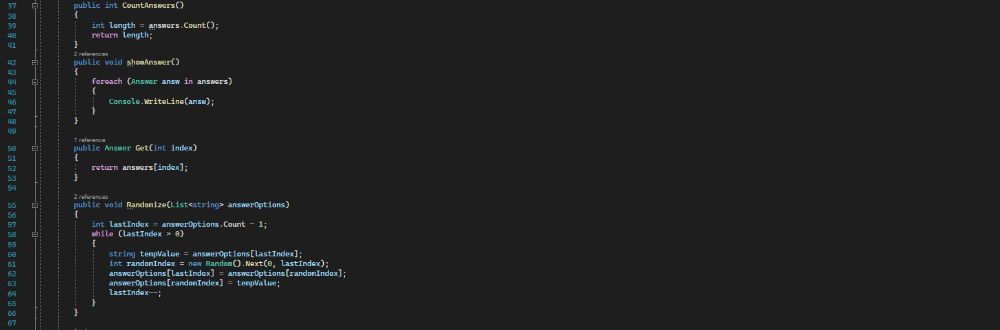

# Questionnaire Application
Welcome to this application made by <b> Esteban Desmedt </b>. This application was made as part of a school project. The program was made entirely in C# and developed for the subject Object Oriënted Programming, given at Vives (Xaveriaenenstraat 10, 8200 Brugge).
<h3> UML Diagram </h3>

 

## Table of Contents

- [User guide](#section-1)
- [Update schedule](#section-2)
- [Future changes](#section-3)
- [Code explanation](#section-4)
- [Bug fixes](#section-5)
- [Sources](#section-6)
- [Licensing](#section-7)

## User guide
Well how do you use the app? You will be welcomed to the next screen, here you can fill in your username. The username can contain numbers and letters and can't exceed the maximum length of 10 characters. Whenever you press the "Start Playing" button you will be directed to the next page containing the game itself.
  

You do however get the chance to press the about button, containing some basic information about this application. I also implemented a button to go back to the starting page.
  

After proceeding to the main window you will find next graphical layout. At the bottom you find your username accompanied by a question tracker to it's right. This will tell which question your on. To proceed to the first question you need to press the "Next" button.
  

When you press the button the request will be send for the question and the answers, more information about this follows later in the readme. Whenever the request is done you will get the question on your screen, followed by four possible answers. At the left you find the difficulty and the category.
  

Now it's up to you to choose an option. If you guess the right answer, it will turn green. However if you fail to get the correct answer the background will turn red. Meanwhile the correct answer will be shown with a green background. Your score (at the right) will update after answering. Finally press next to see the new question. I chose to include 12 questions for now. Whenever you press next after your final answer you will go to the scoreboard.  
 

On this page you will see a few of your stats from the previous game. First you will find the amount of answered questions. I'm trying to implement a system so the player chooses the amount of questions before the game. In the middle you will find the amount of correctly answered questions followed by the number of incorrect ones. You will also find the time you spend in the game and the score you got. The timer starts when you start the game and ends when you press next to go to the scoreboard. Here you have another next button.
  

To finish off you will find the leaderboard page, this page will simply display the top 5 on the app, updating with all scores. This means the other scores aren't just invented but they are other people who played the game. After admiring your placement you can choose to restart (from login) or quit.

## Update schedule
<ul>
    <li> Creating the Question and Answer class in the Questionnaire library</li>
    Answer class:
      
    
    Question class:
      
    
    
    
      
    <li> Designing the WPF application layout</li>
    <li> Adding functionality:</li>
    <ul>
    <li>"Next" button - Showing the next question</li>
    <li>"Scoredisplay" - Displaying the question you're on</li>
    <li>"Answer" Buttons - Displaying the answers</li>
    </ul>
    <li> Coding the code behind each button and the logics connecting the triviaAPI, containing the questions, with the Question class and application</li>
    <li> Adding a Login form</li>
    <li> Adding a scoreboard</li>
    <li> Adding two new methods</li>
     
    
    <li> Using tags</li> 
    <li> Adding a leaderboard</li>
    <li> Making a saveable leaderboard</li>
    <li> Displaying the difficulty and category</li>
</ul>

## Future changes
<ul> 

✔ - Implemented
✖ - Dropped
☐ - Yet to be implemented
    <li>Scoreboard implementation ✔</li>
    <li>Checking for correct question ✔</li>
    <li>Button turns green when correct, red when wrong ✔</li>
    <li>Add a timer on scoreboard, showing the time spend on the game ✔</li>
    <li>Disable the hovering of a button before you press the button to get the first question ✔</li>
    <li>Adding a progress bar, showing your percentage on the scoreboard ✔</li>
    <li>When skipping a question the score display doesn't update ✔</li>
    <li>Next button start as start button, then changes to next button and ends as finish button ✔</li>
    <li>Displaying the Category and Difficulty in the application ✔</li>
    <li>Scoreboard with names and a score ✔</li>
    <li>You go to the next question when answering, this change would make it possible to change the next button to a "Start" button. ✖</li>
    <li>"Start" button in the middle till you press start, then the questions appear  and the button disappears but Adding a skip button on the spot if the "Next" button right now. ✖</li>
    <li>Making the user choose the amount of questions ☐</li>
    <li>Category and Difficulty buttons (commented code in login) ☐</li>
    
</ul>

## Code explanation
- Answer class:
In the Answer class you find two properties containing a string called Text and a boolean named isCorrect.
The answer method returns the combination of the text and the string.
- Question class:
The question class contains a list of answer, this list contains the text and boolean. In question there is also a property Text, this is for the question. The default contructor gives an empty string while the constructor adds the question. The method Add() adds the answer and boolean as type Answer to the list.
The Get() method gives the answer on a random index. Following that the Randomize() method shuffles all the possible answers. Finally the FindCorrectAnswerIndex() method gives the index of the correct answer being usefull for showing the correct answer if the incorect one is given.
- Playerscore class:
This contains a name and a score property.
- ScoreboardCL class:
Here you can add scores to a list and you'll find another ToString method. Finally you will find two methods. One will add a player and score to the text file containing all scores and the other will read them out.

## Bug fixes
<ul>
    <li>Score calculation: when getting 12 questions right you'd get an error. This would occur because you'd have 0 wrong answer and you devide by the wrong answer --> Fixed by deviding by "Wrong answers + 1"</li>
    <li>Percentage on scoreboard wouldn't show in some cases --> fixed with new formula</li>
    <li>Score not updating when skipping a question ,till answering a new one --> Implemented in Next button as well</li>
    <li>Fixed the bug where the game crashed when pressing on the screen (one of the answer buttons) before you load the answers (press start) --> Disabled all buttons at the start</li>
    <li>When no username given a random Username will be generated</li>
</ul>

## Sources
- https://www.youtube.com/watch?v=cST5TT3OFyg
- https://base-to-ace.netlify.app/about-this-course/ 
- https://www.youtube.com/watch?v=qh5LhpaKC-c
 
## Licensing

Made by Esteban Desmedt, student @ Vives Brugge 8200, Xaveriaenenstraat 10

for the Subject Object Oriented Programming (first year, phase 2) 2023

